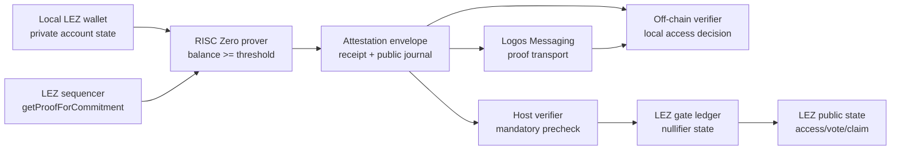
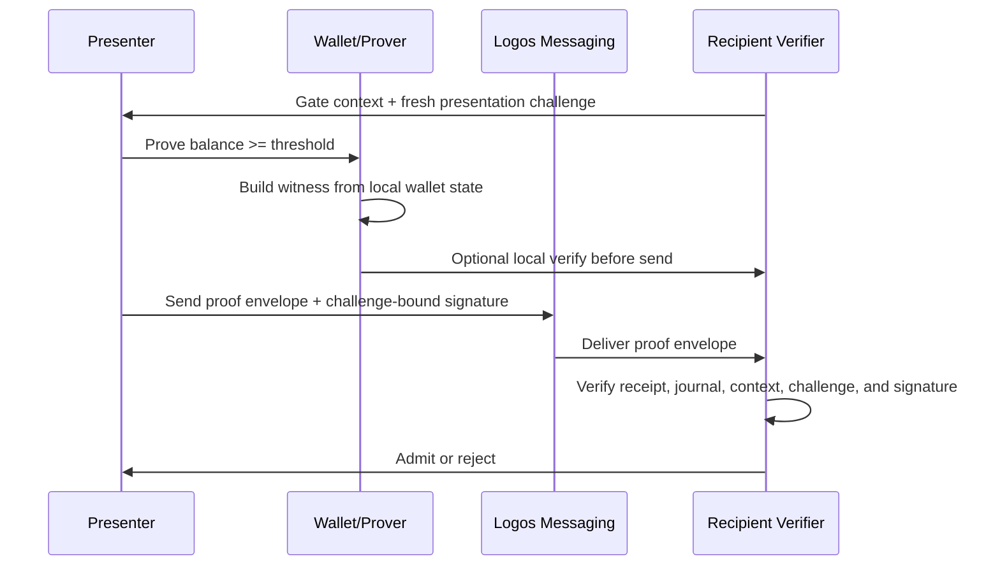

# Architecture

`logos-private-balance-attestation` is a reusable primitive for proving that a
private LEZ account balance meets a public threshold without revealing the
account or exact balance.

The current implementation has one proof format and two verification paths:



## Components

| Component | Responsibility |
| --- | --- |
| `attestation-core` | Shared types, error codes, public journal schema, context hashing, nullifier derivation, LEZ-compatible commitment and Merkle root helpers. |
| `attestation-prover` | Reads local wallet state, fetches the Merkle membership proof from the sequencer, builds the witness, and runs the RISC Zero prover. |
| `attestation-verifier` | Verifies an attestation envelope locally without submitting a transaction. |
| `attestation-messaging` | Transport-neutral proof message wrapper, local JSON adapter, and token-gated admission book for the off-chain path. |
| `attestation-cli` | Developer CLI for proving, verifying, and invoking the current Workable gate path. |
| `methods/guest` | RISC Zero guest circuit that checks balance threshold, commitment reconstruction, Merkle membership, and context binding. |
| `lez-verifier/program` | Deployable LEZ gate-ledger/nullifier program used after host-side envelope verification. |
| `apps/basecamp` | Backend-backed `ui_qml` MVP that wraps preflight, proof generation, envelope verification, and Workable gate admit. |
| `examples` | Reference integrations required by the prize: governance gate, Messaging group gate, and a third app. |

## Basecamp MVP

`apps/basecamp/` keeps the visual layer thin and delegates to the same local
scripts used by the reproducible terminal demo:

```text
check-wallet-preflight.sh
  -> demo-local-sequencer-e2e.sh
  -> balance-attest verify
  -> demo-local-gate-e2e.sh
```

The backend sets `LOGOS_LEZ_REPO`, `LEZ_REPO`, `NSSA_WALLET_HOME_DIR`,
`RISC0_DEV_MODE`, context fields, and output directories before each command.
It reads public outputs such as `run.json`, `verify.json`, and gate reports.
It does not parse or display `witness.json`.

## LEZ Private Account Commitment

The prize describes the private account commitment as:

```text
SHA256(npk || program_owner || balance || nonce || SHA256(data))
```

The current local `logos-execution-zone` fork is more specific. In
`nssa/core/src/commitment.rs`, `Commitment::new(account_id, account)` computes:

```text
SHA256(
  "/LEE/v0.3/Commitment/" padded to 32 bytes
  || account_id
  || program_owner as 8 little-endian u32 words
  || balance as little-endian u128
  || nonce as little-endian u128
  || SHA256(data)
)
```

For private accounts, `account_id` is the LEZ private account id derived by
LEZ from the nullifier public key and account identifier. The attestation
witness keeps both `account_id` and `npk` private: `account_id` reconstructs the
current LEZ commitment, while `npk` remains the input to the context nullifier.
The circuit must match the checked-out implementation, not only the simplified
prize text. This is a hard compatibility requirement.

Milestone 2 starts this as pure Rust in `attestation-core`:

```text
LezPrivateAccountCommitmentInput
  -> derive_lez_private_account_commitment(...)
  -> hash_lez_commitment_leaf(...)
  -> compute_lez_membership_root(...)
```

The local compatibility script compares these helpers against
`nssa_core::Commitment::new` and `nssa_core::compute_digest_for_path` from the
checked-out LEZ repo.

## Merkle Membership

The sequencer exposes the real JSON-RPC method:

```text
getProofForCommitment(commitment) -> Option<MembershipProof>
```

In the local LEZ code, `MembershipProof` is:

```rust
type MembershipProof = (usize, Vec<[u8; 32]>);
```

The digest path starts from `SHA256(commitment_bytes)`, then hashes sibling
pairs up the tree. The circuit must reproduce the same path calculation.

## Proof Envelope V1

The planned proof envelope is the transport object used by both verification
paths:

```json
{
  "version": 1,
  "proof_system": "risc0",
  "image_id": "<risc0-image-id-hex>",
  "journal": {
    "version": 1,
    "threshold": "100",
    "commitment_root": "<hex-32>",
    "context_id": "<hex-32>",
    "context_nullifier": "<hex-32>",
    "presenter_id": "<hex-32>",
    "verifier_id": "<hex-32>",
    "circuit_image_id": "<risc0-image-id-hex>",
    "proof_index": 5,
    "proof_depth": 16
  },
  "receipt": "<hex-encoded serde_json risc0_zkvm::Receipt>",
  "presenter_pubkey": "<hex-32 BIP-340 x-only Schnorr pubkey>",
  "presentation_challenge": "<hex-32 verifier/session challenge>",
  "presenter_signature": "<hex-64 BIP-340 Schnorr signature over presentation_digest(journal.digest(), presentation_challenge)>"
}
```

The CLI uses JSON for developer interchange. The on-chain LEZ wire format is
Borsh V1 (per `idl/balance-attestation-verifier.json`); the CLI's
`balance-attest verify` consumes JSON envelopes directly.

`presenter_id = SHA256(PRESENTER_DOMAIN || presenter_pubkey)` — the journal
commits the hash, the envelope carries the pubkey itself, the verifier checks
both.

## Circuit Witness

Private witness:

- `npk`
- `program_owner`
- `balance`
- `nonce`
- `data_hash`
- Merkle membership proof

Public journal:

- threshold
- context id
- commitment root
- context-bound nullifier
- presenter id
- verifier id
- circuit image id

The circuit checks:

1. `balance >= threshold`.
2. The LEZ commitment is reconstructed exactly.
3. The Merkle path resolves to the public commitment root.
4. The context nullifier is derived from the private account and public context.
5. The public journal binds the proof to a presenter id and verifier/context id.

The production journal should not publish the private commitment leaf. Spike 03
published it for debugging; Spike 04 removes it from the public journal and
keeps it as witness-only intermediate state.

## Context Binding

The context id prevents replay across gates. It should be derived from stable
public data:

```text
context_id = SHA256(
  "logos-balance-attestation/v1/context"
  || chain_id
  || circuit_image_id
  || verifier_id
  || gate_id
  || threshold
)
```

Changing any of these values should make an old proof invalid for the new gate.

## Presenter Binding

LP-0005 calls out proof forwarding as a known open problem. The implementation
binds the proof to a presenter via BIP-340 Schnorr over secp256k1:

- The presenter holds a 32-byte secret. Its public counterpart is a 32-byte
  x-only Schnorr public key.
- `presenter_id = SHA256(PRESENTER_DOMAIN || presenter_pubkey)` — the journal
  commits the hash; the envelope carries the pubkey.
- The context nullifier includes the presenter id, so the same private account
  produces different nullifiers per presenter.
- Off-chain: the verifier supplies a fresh 32-byte presentation challenge, and
  the prover signs `presentation_digest(journal.digest(), challenge)` with the
  secret. The envelope carries `(pubkey, challenge, signature)`. The off-chain
  verifier (`attestation_verifier::verify_envelope`) checks the expected
  challenge, `H(pubkey) == journal.presenter_id`, and the Schnorr signature.
  If an application reuses a static challenge, a captured complete envelope can
  still be replayed into that same static session; fresh challenge generation is
  the application-layer responsibility.
- On-chain: the LEZ tx must be signed by, or otherwise authenticated to, the
  presenter account. The LEZ program must assert the runtime-derived presenter
  id equals `journal.presenter_id`. The in-memory `LezGateProgram` models this
  as `admit(proof, presenter_id)`; the live LEZ adapter still needs to derive
  that presenter id from real signer/account context.

The circuit only hashes the pubkey (no in-circuit ECC). Knowledge-of-secret
is proved off-circuit by the BIP-340 signature: only the secret-holder can
produce a signature that verifies under the pubkey committed in the journal.

This does not prevent voluntary collusion where Alice generates a proof for
Bob's presenter id or shares her secret. It also only prevents first-use replay
of a captured complete envelope when the verifier generates a fresh challenge
per admission/session and rejects stale challenges.

## Off-Chain Path



The verifier learns only the public threshold, context, presenter id, and
whether the proof verifies.

The current repository implements this transport-neutral path in
`crates/attestation-messaging` and exposes it through:

```text
balance-attest message-export
balance-attest message-receive
balance-attest message-verify
balance-attest message-admit
```

`message-export` wraps the public proof envelope as a V1 proof message with
`group_id`, `sender`, optional `recipient`, and local transport metadata.
`message-receive` decodes the message and can write the embedded envelope back
to disk. `message-verify` runs the same `attestation-verifier` checks as the
regular off-chain path. `message-admit` verifies the message and persists the
context nullifier in a local admission book, rejecting duplicate admission.

This is intentionally a local JSON adapter. A future Logos Messaging adapter
should implement the same `ProofMessageTransport` trait and carry the same
message bytes over the real network.

## On-Chain Path

The on-chain path has two layers per Spike 0C
(`docs/ONCHAIN_PATH_DECISION.md`):

1. The prover wraps the inner balance-attestation receipt in an outer
   LEZ-gate receipt (`lez-verifier/guest/src/bin/lez_balance_gate.rs`,
   pinned `LEZ_BALANCE_GATE_ID`). This is the recursion artifact that
   `lez_verifier::prove_lez_gate` produces.
2. A deployable LEZ program
   (`lez-verifier/program/guest/src/bin/balance_attestation_program.rs`,
   pinned `BALANCE_ATTESTATION_PROGRAM_ID`) is registered on the sequencer
   via `wallet deploy-program`. The program admits a presenter into a gate
   state account (`(gate_context_id, threshold, admitted_nullifiers)`) when
   submitted through the current public transaction runner.

```mermaid
sequenceDiagram
  participant A as Presenter
  participant CLI as CLI / SDK
  participant L as lez-verifier (host)
  participant V as off-chain verifier
  participant W as LEZ wallet
  participant S as LEZ sequencer
  participant P as deployed LEZ program

  A->>CLI: prove_attestation(witness, params, challenge) -> envelope
  CLI->>L: prove_lez_gate(envelope, gate_config) -> LezGateProof
  CLI->>V: verify_envelope(envelope, expected_gate)  // host trust seat
  V-->>CLI: ok | BAxxx
  CLI->>W: build Admit { outer_journal } over (gate, presenter) pre-states
  W->>S: send public LEZ tx(accounts, instruction, program)
  S->>P: execute Instruction::Admit
  P->>P: decode GateState from pre_states[0].account.data
  P->>P: derive presenter_id = H(PRESENTER_DOMAIN || presenter.account.data[..32])
  P->>P: assert journal version, inner_image_id, context, threshold, presenter
  P->>P: append accepted_context_nullifier; dedup against admitted_nullifiers
  P-->>S: ProgramOutput (post_states updated)
  S-->>A: tx hash | deterministic BAxxx panic in sequencer log
```

### Trust seat

The deployed program does **not** call `env::verify` on the outer receipt
(Spike 06: deployed public LEZ programs have no `add_assumption` channel
for an external receipt). Spike 08 then showed that the live local sequencer
applies a well-formed fabricated `outer_journal`; it does not bind that
journal to a RISC Zero receipt at admission time. The trust seat is therefore
at the host: the CLI calls `attestation_verifier::verify_envelope` before
building the LEZ tx, and only submits if verification passes. The on-chain
program then enforces all application-level binding (gate context, exact
threshold, presenter pubkey hash, nullifier dedup) over the journal it
receives in calldata.

### Live adapter

`scripts/spike-08-run.sh` plus
`spikes/spike-08-program-chaining/lez/runner/` is the live submit binary —
it builds the program ELF, deploys it, creates the gate-state and presenter
accounts, and submits `register_presenter`, `init_gate`, then `admit` via
an `nssa::PublicTransaction`. The CLI wraps the same runner with first-class
`gate-register-presenter`, `gate-init`, and `gate-admit` commands. The admit
command adds the host pre-verification step before any transaction can be
submitted.

The in-memory `LezGateProgram::admit` rehearsal stays as the
no-sequencer regression suite (`lez-verifier/tests/onchain_e2e.rs`); it
exercises the full receipt-verifying model. The deployed program currently
exercises the application-state subset only, because the local sequencer does
not expose receipt binding for this public program path.

## Why this shape (Blocker 0)

A previous LP-0005 submission was rejected for using a standalone Rust verifier
that could not be deployed to LEZ. Spike 06 then established that direct
public `env::verify` over an external receipt is currently not exposed by LEZ:

```text
sys_verify_integrity: no receipt found to resolve assumption
```

So the deployed shape cannot honestly be called a complete receipt-verifying
LEZ program yet. The current repo ships both pieces: the outer guest in
`lez-verifier/` proves the recursive gate off-chain, and the deployable LEZ
program records/dedups admissions after a host precheck. See
`docs/ONCHAIN_PATH_DECISION.md` and `docs/RISK_SPIKES.md` for the path that
led here:

1. Direct public `env::verify` of an external receipt — failed/unsupported.
2. Recursive / native verifier — no local public LEZ path found.
3. Logos-native gate ledger with host pre-verification — implemented locally,
   still pending evaluator acceptance for LP-0005's on-chain wording.
