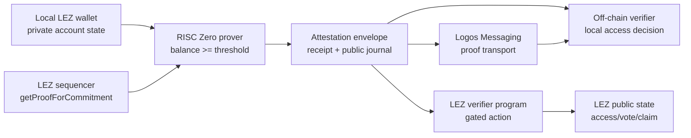
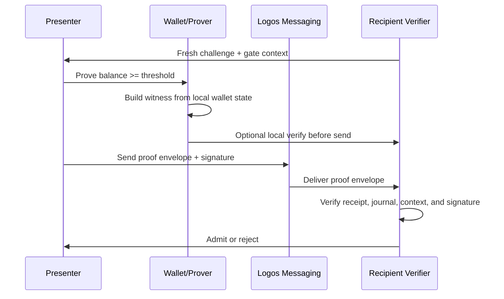

# Architecture

`logos-private-balance-attestation` is a reusable primitive for proving that a
private LEZ account balance meets a public threshold without revealing the
account or exact balance.

The intended final product has one proof format and two verification paths:



## Components

| Component | Responsibility |
| --- | --- |
| `attestation-core` | Shared types, error codes, public journal schema, context hashing, nullifier derivation, LEZ-compatible commitment and Merkle root helpers. |
| `attestation-prover` | Reads local wallet state, fetches the Merkle membership proof from the sequencer, builds the witness, and runs the RISC Zero prover. |
| `attestation-verifier` | Verifies an attestation envelope locally without submitting a transaction. |
| `attestation-cli` | Developer CLI for proving, verifying, sending, receiving, and invoking the on-chain path. |
| `methods/guest` | RISC Zero guest circuit that checks balance threshold, commitment reconstruction, Merkle membership, and context binding. |
| `lez/verifier-program` | LEZ program that accepts a proof envelope and gates an on-chain action. |
| `apps/basecamp` | Basecamp GUI that wraps the CLI/backend flow for a visual demo. |
| `examples` | Reference integrations required by the prize: governance gate, Messaging group gate, and a third app. |

## LEZ Private Account Commitment

The prize describes the private account commitment as:

```text
SHA256(npk || program_owner || balance || nonce || SHA256(data))
```

The local `logos-execution-zone` implementation is more specific. In
`nssa/core/src/commitment.rs`, `Commitment::new` computes:

```text
SHA256(
  "/LEE/v0.3/Commitment/" padded to 32 bytes
  || npk
  || program_owner as 8 little-endian u32 words
  || balance as little-endian u128
  || nonce as little-endian u128
  || SHA256(data)
)
```

The circuit must match the implementation, not only the simplified prize text.
This is a hard compatibility requirement.

Milestone 2 starts this as pure Rust in `attestation-core`:

```text
LezPrivateAccountCommitmentInput
  -> derive_lez_private_account_commitment(...)
  -> hash_lez_commitment_leaf(...)
  -> compute_lez_membership_root(...)
```

The local compatibility script compares these helpers against
`nssa_core::Commitment::new` and `nssa_core::compute_digest_for_path` from the
checked-out LEZ repo.

## Merkle Membership

The sequencer exposes the real JSON-RPC method:

```text
getProofForCommitment(commitment) -> Option<MembershipProof>
```

In the local LEZ code, `MembershipProof` is:

```rust
type MembershipProof = (usize, Vec<[u8; 32]>);
```

The digest path starts from `SHA256(commitment_bytes)`, then hashes sibling
pairs up the tree. The circuit must reproduce the same path calculation.

## Proof Envelope V1

The planned proof envelope is the transport object used by both verification
paths:

```json
{
  "version": 1,
  "proof_system": "risc0",
  "image_id": "<risc0-image-id-hex>",
  "journal": {
    "version": 1,
    "threshold": "100",
    "commitment_root": "<hex-32>",
    "context_id": "<hex-32>",
    "context_nullifier": "<hex-32>",
    "presenter_id": "<hex-32>",
    "verifier_id": "<hex-32>",
    "circuit_image_id": "<risc0-image-id-hex>",
    "proof_index": 5,
    "proof_depth": 16
  },
  "receipt": "<hex-encoded serde_json risc0_zkvm::Receipt>",
  "presenter_pubkey": "<hex-32 BIP-340 x-only Schnorr pubkey>",
  "presenter_signature": "<hex-64 BIP-340 Schnorr signature over journal.digest()>"
}
```

The CLI uses JSON for developer interchange. The on-chain LEZ wire format is
Borsh V1 (per `idl/balance-attestation-verifier.json`); the CLI's
`balance-attest verify` consumes JSON envelopes directly.

`presenter_id = SHA256(PRESENTER_DOMAIN || presenter_pubkey)` — the journal
commits the hash, the envelope carries the pubkey itself, the verifier checks
both.

## Circuit Witness

Private witness:

- `npk`
- `program_owner`
- `balance`
- `nonce`
- `data_hash`
- Merkle membership proof

Public journal:

- threshold
- context id
- commitment root
- context-bound nullifier
- presenter id
- verifier id
- circuit image id

The circuit checks:

1. `balance >= threshold`.
2. The LEZ commitment is reconstructed exactly.
3. The Merkle path resolves to the public commitment root.
4. The context nullifier is derived from the private account and public context.
5. The public journal binds the proof to a presenter id and verifier/context id.

The production journal should not publish the private commitment leaf. Spike 03
published it for debugging; Spike 04 removes it from the public journal and
keeps it as witness-only intermediate state.

## Context Binding

The context id prevents replay across gates. It should be derived from stable
public data:

```text
context_id = SHA256(
  "logos-balance-attestation/v1/context"
  || chain_id
  || circuit_image_id
  || verifier_id
  || gate_id
  || threshold
)
```

Changing any of these values should make an old proof invalid for the new gate.

## Presenter Binding

LP-0005 calls out proof forwarding as a known open problem. The implementation
binds the proof to a presenter via BIP-340 Schnorr over secp256k1:

- The presenter holds a 32-byte secret. Its public counterpart is a 32-byte
  x-only Schnorr public key.
- `presenter_id = SHA256(PRESENTER_DOMAIN || presenter_pubkey)` — the journal
  commits the hash; the envelope carries the pubkey.
- The context nullifier includes the presenter id, so the same private account
  produces different nullifiers per presenter.
- Off-chain: the prover signs `journal.digest()` with the secret. The
  envelope carries `(pubkey, signature)`. The off-chain verifier
  (`attestation_verifier::verify_envelope`) checks both
  `H(pubkey) == journal.presenter_id` and the Schnorr signature.
- On-chain: the LEZ tx is signed by the presenter account; the LEZ program
  asserts that account's hash equals `journal.presenter_id`. The on-chain
  path does not need the off-chain Schnorr signature because LEZ tx signing
  already enforces presenter identity.

The circuit only hashes the pubkey (no in-circuit ECC). Knowledge-of-secret
is proved off-circuit by the BIP-340 signature: only the secret-holder can
produce a signature that verifies under the pubkey committed in the journal.

This does not prevent voluntary collusion where Alice generates a proof for
Bob's presenter id or shares her secret. It does prevent a passive third party
from reusing a captured proof as themselves.

## Off-Chain Path



The verifier learns only the public threshold, context, presenter id, and
whether the proof verifies.

## On-Chain Path

The on-chain path is implemented as a two-stage recursion (Spike 0C, per
`docs/ONCHAIN_PATH_DECISION.md`): the prover wraps the inner balance-attestation
receipt in an outer LEZ-gate receipt that the LEZ on-chain program verifies.

```mermaid
sequenceDiagram
  participant A as Presenter
  participant CLI as CLI / SDK
  participant L as lez-verifier (host)
  participant P as LEZ Verifier Program
  participant S as Sequencer

  A->>CLI: prove_attestation(witness, params) -> envelope
  CLI->>L: prove_lez_gate(envelope, gate_config)
  L->>L: Outer guest: env::verify(BALANCE_ATTESTATION_ID, inner_journal)
  L->>L: Recompute context_id, assert match, threshold floor, verifier_id
  L->>CLI: LezGateProof { outer_journal, outer_receipt_bytes }
  CLI->>S: Submit (outer_receipt_bytes, presenter_account)
  S->>P: admit(outer_receipt_bytes)
  P->>P: Verify outer receipt against pinned LEZ_BALANCE_GATE_ID
  P->>P: Assert outer_journal.inner_image_id == BALANCE_ATTESTATION_ID
  P->>P: Assert gate_context_id matches; dedup nullifier
  P->>S: Admit or return deterministic BAxxx error
```

The outer LEZ-gate guest lives at `lez-verifier/guest/src/bin/lez_balance_gate.rs`
and is built into a self-contained image (`LEZ_BALANCE_GATE_ID`). The LEZ
on-chain program (modeled in-memory by `lez_verifier::LezGateProgram`) runs
exactly the steps above.

The first gated action is intentionally small:

```text
admit(outer_receipt_bytes) -> Result<recorded_nullifier, BAxxx>
```

The program writes public state `(gate_context_id → set<context_nullifier>)`
showing that the presenter passed the gate for a context. It does not write
the private account id, `npk`, balance, or witness.

## Why this shape (Blocker 0)

A previous LP-0005 submission was rejected for using a standalone Rust verifier
that could not be deployed to LEZ. Spike 06 then established that direct
public `env::verify` over an external receipt is currently not exposed by LEZ:

```text
sys_verify_integrity: no receipt found to resolve assumption
```

So the deployed shape **must** be a Logos-native private execution gate that
can attach receipts as assumptions. That is exactly what the outer guest in
`lez-verifier/` does. See `docs/ONCHAIN_PATH_DECISION.md` and
`docs/RISK_SPIKES.md` for the path that led here:

1. Direct public `env::verify` of an external receipt — failed/unsupported.
2. Recursive / native verifier — no local public LEZ path found.
3. Logos-native private execution gate — implemented (`lez-verifier/`),
   pending evaluator acceptance for LP-0005.
