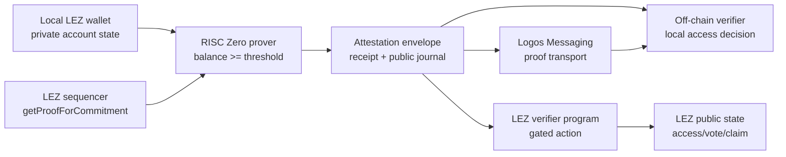
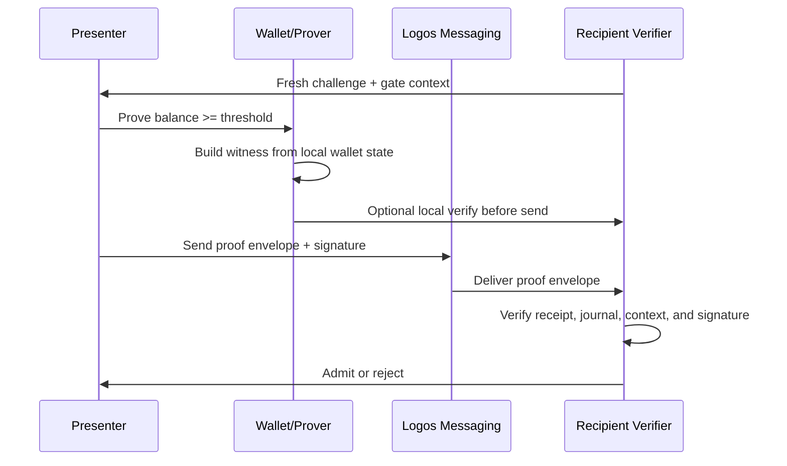
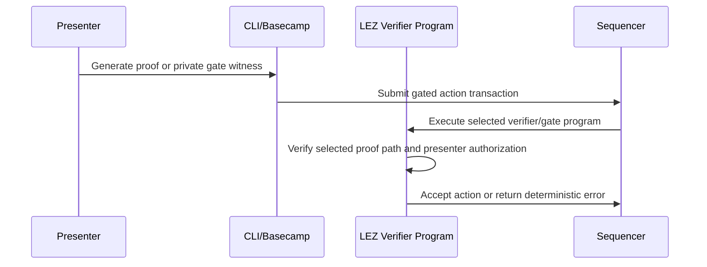

# Architecture

`logos-private-balance-attestation` is a reusable primitive for proving that a
private LEZ account balance meets a public threshold without revealing the
account or exact balance.

The intended final product has one proof format and two verification paths:



## Components

| Component | Responsibility |
| --- | --- |
| `attestation-core` | Shared types, error codes, public journal schema, context hashing, nullifier derivation, LEZ-compatible commitment and Merkle root helpers. |
| `attestation-prover` | Reads local wallet state, fetches the Merkle membership proof from the sequencer, builds the witness, and runs the RISC Zero prover. |
| `attestation-verifier` | Verifies an attestation envelope locally without submitting a transaction. |
| `attestation-cli` | Developer CLI for proving, verifying, sending, receiving, and invoking the on-chain path. |
| `methods/guest` | RISC Zero guest circuit that checks balance threshold, commitment reconstruction, Merkle membership, and context binding. |
| `lez/verifier-program` | LEZ program that accepts a proof envelope and gates an on-chain action. |
| `apps/basecamp` | Basecamp GUI that wraps the CLI/backend flow for a visual demo. |
| `examples` | Reference integrations required by the prize: governance gate, Messaging group gate, and a third app. |

## LEZ Private Account Commitment

The prize describes the private account commitment as:

```text
SHA256(npk || program_owner || balance || nonce || SHA256(data))
```

The local `logos-execution-zone` implementation is more specific. In
`nssa/core/src/commitment.rs`, `Commitment::new` computes:

```text
SHA256(
  "/LEE/v0.3/Commitment/" padded to 32 bytes
  || npk
  || program_owner as 8 little-endian u32 words
  || balance as little-endian u128
  || nonce as little-endian u128
  || SHA256(data)
)
```

The circuit must match the implementation, not only the simplified prize text.
This is a hard compatibility requirement.

Milestone 2 starts this as pure Rust in `attestation-core`:

```text
LezPrivateAccountCommitmentInput
  -> derive_lez_private_account_commitment(...)
  -> hash_lez_commitment_leaf(...)
  -> compute_lez_membership_root(...)
```

The local compatibility script compares these helpers against
`nssa_core::Commitment::new` and `nssa_core::compute_digest_for_path` from the
checked-out LEZ repo.

## Merkle Membership

The sequencer exposes the real JSON-RPC method:

```text
getProofForCommitment(commitment) -> Option<MembershipProof>
```

In the local LEZ code, `MembershipProof` is:

```rust
type MembershipProof = (usize, Vec<[u8; 32]>);
```

The digest path starts from `SHA256(commitment_bytes)`, then hashes sibling
pairs up the tree. The circuit must reproduce the same path calculation.

## Proof Envelope V1

The planned proof envelope is the transport object used by both verification
paths:

```json
{
  "version": 1,
  "proof_system": "risc0",
  "image_id": "<risc0-image-id-hex>",
  "journal": {
    "version": 1,
    "threshold": "100",
    "context_id": "<hex-32>",
    "commitment_root": "<hex-32>",
    "context_nullifier": "<hex-32>",
    "presenter_id": "<hex-32-or-public-account-id>",
    "verifier_id": "<hex-32-or-program-id>",
    "circuit_image_id": "<risc0-image-id-hex>"
  },
  "receipt": "<encoded-receipt>",
  "presenter_signature": "<signature-over-journal-and-challenge>"
}
```

The exact binary encoding can be Borsh for Rust internals and JSON for CLI/demo
interchange. The JSON shape is intentionally human-readable for debugging.

## Circuit Witness

Private witness:

- `npk`
- `program_owner`
- `balance`
- `nonce`
- `data_hash`
- Merkle membership proof

Public journal:

- threshold
- context id
- commitment root
- context-bound nullifier
- presenter id
- verifier id
- circuit image id

The circuit checks:

1. `balance >= threshold`.
2. The LEZ commitment is reconstructed exactly.
3. The Merkle path resolves to the public commitment root.
4. The context nullifier is derived from the private account and public context.
5. The public journal binds the proof to a presenter id and verifier/context id.

The production journal should not publish the private commitment leaf. Spike 03
published it for debugging; Spike 04 removes it from the public journal and
keeps it as witness-only intermediate state.

## Context Binding

The context id prevents replay across gates. It should be derived from stable
public data:

```text
context_id = SHA256(
  "logos-balance-attestation/v1/context"
  || chain_id
  || circuit_image_id
  || verifier_id
  || gate_id
  || threshold
)
```

Changing any of these values should make an old proof invalid for the new gate.

## Presenter Binding

LP-0005 calls out proof forwarding as a known open problem. This design binds
the proof to a presenter id:

- The presenter id is part of the public journal.
- The context nullifier includes the presenter id.
- Off-chain verifiers require a fresh signature over the journal digest and a
  verifier challenge.
- On-chain verification includes an authorized presenter account and checks it
  matches the presenter id in the proof journal.

This does not prevent voluntary collusion where Alice generates a proof for
Bob's presenter id or shares her private key. It does prevent a passive third
party from reusing a captured proof as themselves.

V1 uses a separate presenter signature over the proof journal and verifier
challenge. Spike 04 additionally validates the stronger shape where the circuit
proves knowledge of presenter material that derives `presenter_id`; the
production adapter still needs to map that to a real wallet-compatible
presenter key.

## Off-Chain Path



The verifier learns only the public threshold, context, presenter id, and
whether the proof verifies.

## On-Chain Path



The first gated action should be intentionally small, such as:

```text
claim_access(context_id, proof_envelope)
```

The program writes public state showing that the presenter passed the gate for a
context. It must not write the private account id, `npk`, balance, or witness.

## Blocker 0: On-Chain Proof Path

The on-chain verifier must be a real LEZ program. A previous LP-0005 submission
was rejected for using a standalone Rust verifier that could not be deployed to
LEZ.

The implementation already tested direct public receipt verification inside a
LEZ guest. It builds, but runtime execution currently fails because public LEZ
execution does not expose a RISC Zero assumption/receipt channel:

```text
sys_verify_integrity: no receipt found to resolve assumption
```

That makes direct public `env::verify` a failed/currently unsupported path, not
the primary architecture.

Remaining options:

- use Logos-native private execution as the on-chain gate path if evaluators
  confirm it satisfies LP-0005
- keep host-side/off-chain receipt verification for Messaging and local app
  flows

Host-side pre-verification is useful for development, but it cannot satisfy the
on-chain prize requirement by itself.

This is a hard prerequisite, not a late implementation detail. See
`docs/ONCHAIN_PATH_DECISION.md` and `docs/RISK_SPIKES.md` for the modular spike
plan:

1. direct RISC Zero receipt verification inside a LEZ guest: failed/currently
   unsupported
2. recursive/native verifier support: inspected; no local public LEZ path found
3. Logos-native private execution gate with explicit evaluator confirmation:
   passed locally, pending acceptance
